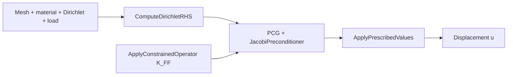

# matrix-free-fea

Header-only C++17 library for **matrix-free** linear elasticity on **P2 (10-node) tetrahedra**.

The core idea is to apply \(y = Ku\) without assembling the global stiffness matrix \(K\). Element contributions are recomputed from geometry and material data on every application, so the working set is essentially the displacement and force vectors rather than a sparse matrix. That trades arithmetic for memory traffic—a favorable tradeoff on bandwidth-limited hardware, especially GPUs.

The supported path today is **CPU-first**: develop and verify the operator and Krylov solve on the host, then port the operator to CUDA. The repo is a concrete FEM + iterative-solver artifact for learning and computational-physics solver work.

## Current status (CPU)

The CMake build is **CPU-only** (`LANGUAGES CXX`, Eigen3, interface library `matrix-free-fea`). What ships:

- Affine-geometry P2 tet element operator (4-point Hammer–Stroud quadrature, Lamé materials at quadrature points)
- Global matrix-free operator: gather / apply / scatter in [`src/assembly.hpp`](src/assembly.hpp)
- Matrix-free `diag(K)` for Jacobi via `ComputeGlobalDiagonal`
- Dirichlet elimination (lifted RHS + reduced free–free operator \(K_{FF}\)) in [`src/boundary_conditions.hpp`](src/boundary_conditions.hpp)
- Unpreconditioned CG and **Jacobi PCG** in [`src/linear_solver.hpp`](src/linear_solver.hpp), plus the `SolveDirichletSystem` driver
- Closed-form uniaxial-stress BVP and dedicated solver unit tests

**Not** on the built path yet: mesh I/O, first-class traction / body-force integrators, block Jacobi or multigrid, MPI, or CUDA targets in CMake.

## Repository layout

```
src/                         CPU headers (header-only library)
  types.hpp                  Eigen Vector3 / Matrix3 aliases and helpers
  shape_functions.hpp        P2 tet shape functions and gradients
  quadrature.hpp             4-point Hammer–Stroud rule
  geometry.hpp               Affine element Jacobian and physical gradients
  element_kernel.hpp         Local matrix-free elasticity operator
  mesh.hpp                   Minimal mesh (coords + connectivity)
  assembly.hpp               Global Ku and ComputeGlobalDiagonal
  boundary_conditions.hpp    Dirichlet mask, lifting, SolveDirichletSystem
  linear_solver.hpp          CG / PCG, Identity and Jacobi preconditioners
  cuda/                      Split CUDA operator port (not wired into CMake)
  standalone/
    matrix_free_fea.cu       Monolithic CUDA reference and design notes
tests/                       GoogleTest suites and mesh factories
```

## How the pieces fit

Krylov methods never need \(K\) explicitly—only matvecs. The matrix-free operator *is* that matvec.



Typical solve path: build a Dirichlet mask, form the lifted RHS \(b_F = f_F - K_{FC}u_D\), run PCG on \(K_{FF}\) with a Jacobi diagonal (constrained entries set to 1), then fill prescribed values back into the full field. `SolveDirichletSystem` packages that sequence.

## Build and test

**Dependencies:** CMake ≥ 3.20, a C++17 compiler, [Eigen3](https://eigen.tuxfamily.org/). GoogleTest is pulled via FetchContent when tests are enabled.

```bash
cmake -S . -B build
cmake --build build
ctest --test-dir build --output-on-failure
```

Test executables (under `build/tests/`):

| Executable | Focus |
|---|---|
| `matrix-free-fea_unit_tests` | Types, quadrature, shape functions, geometry, mesh, element kernel, assembly |
| `matrix-free-fea_validation_tests` | Patch tests, null space, energy consistency, refinement checks |
| `matrix-free-fea_end_to_end_tests` | Closed-form uniaxial-stress BVP through CG |
| `matrix-free-fea_linear_solver_tests` | \(K_{FF}\) SPD, CG ≡ identity-PCG, Jacobi vs CG, driver residual |

Run one suite by name or binary:

```bash
ctest --test-dir build -R LinearSolver --output-on-failure
./build/tests/matrix-free-fea_end_to_end_tests
./build/tests/matrix-free-fea_end_to_end_tests --gtest_filter='EndToEnd.*'
```

## GPU expansion (planned)

A CUDA **operator** already lives under [`src/cuda/`](src/cuda/) and as the standalone [`src/standalone/matrix_free_fea.cu`](src/standalone/matrix_free_fea.cu): one thread per element, same gather / apply / scatter structure as the CPU loop, `atomicAdd` on shared nodes, and hand-rolled device `Vector3` / `Matrix3` (no Eigen on device).

That code is **not** part of the CMake build and is not covered by the current tests. There is no GPU linear solver yet.

Planned direction:

- Add CUDA CMake targets and keep the CPU operator as the reference
- CPU-vs-GPU operator parity tests on the same meshes
- Drive CG / PCG with a GPU matvec once the operator is in the build
- Optional mesh coloring to reduce atomic contention
- Template on scalar type (`float` / `double`)

## Near-term roadmap

- Wire CUDA into CMake and add operator parity tests
- Block-Jacobi (nodal 3×3) preconditioner
- \(h\)-refinement iteration comparison (CG vs Jacobi vs mesh size)
- Surface traction (and/or body-force) assembly for load vectors
- MPI / distributed mesh later, if needed
